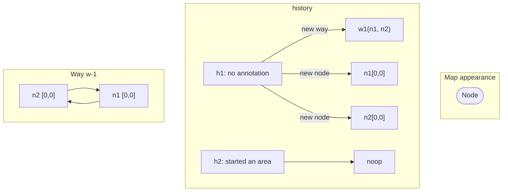
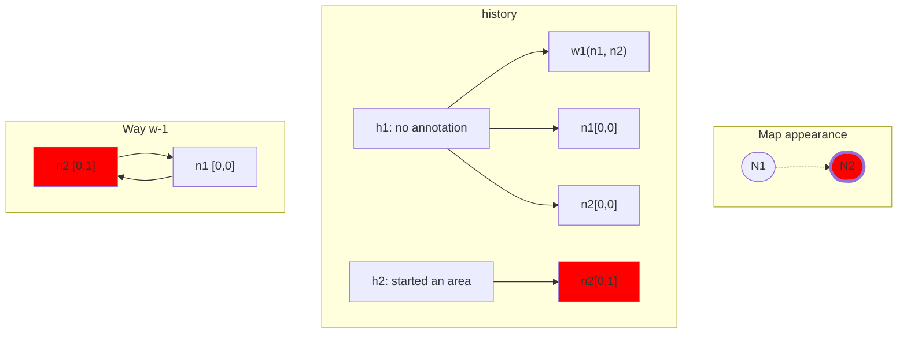
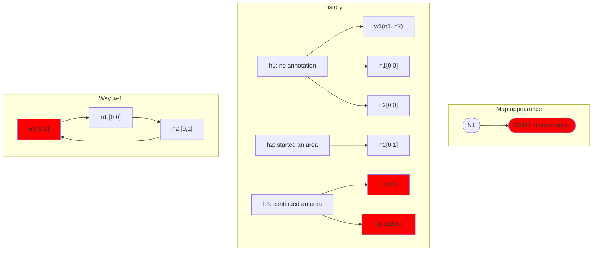
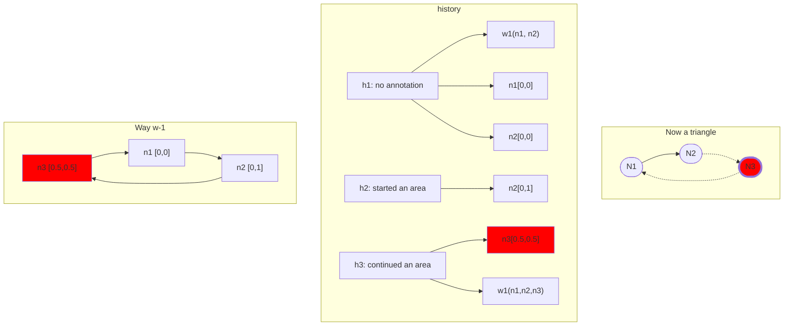
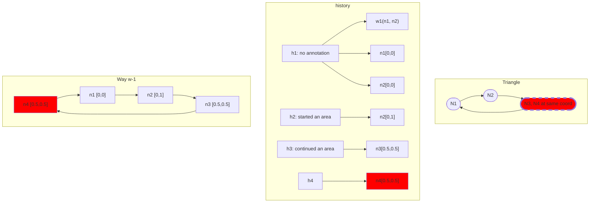
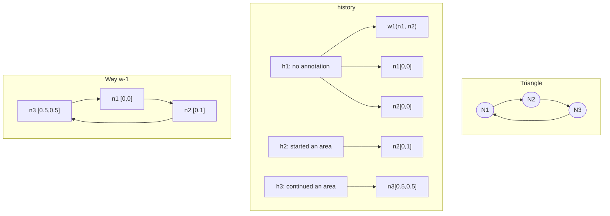

# Drawing Areas

Here's how the area drawing behavior works. This behavior can be entered by hitting the '3' hotkey or by clicking the 'draw area' button in the top toolbar.
During the draw phase, we must make changes to the history. At each history change, we make edits to the graph.


On first click, we perform the following history/graph changes; Assume the user clicks the coordinate [0,0] for simplicity's sake.
1)  A new way 'w1' consisting of two nodes, 'n1' and 'n2'. At this precise moment in time, n1 and n2 have the same location ([0,0]). The way is 'closed' so that it goes from w1->w2->w1. It looks like a point, but it is actually a really simple way.
2) An annotated 'start way' state that contains nothing in it. This will be modified as the user moves the mouse around in the next step.

## Start: User Clicks 0,0 :



## User moves mouse to 0,1 :
Notes: as long as the user moves the mouse around, this step will continually fire, constantly updating the location of the second node in history slot 2, which causes the renderer to redraw the way accordingly.



## User clicks mouse at 0,1 :
Notes: as long as the user moves the mouse around, this step will continually fire, constantly updating the location of the second node in history slot 2, which causes the renderer to redraw the way accordingly.


Next up, the user will move the cursor to .5,.5, making an isosceles triangle.


## User moves mouse to [0.5, 0.5] :
Once again, during 'moves' this step will fire continuously, updating the location of n3.



## User clicks mouse at [0.5, 0.5] :
This will be our last node! node 3 is now locked at .5, .5. Transient node 4 is created and added to the history. If the user drags the mouse around, they will see a quadrilateral appear.



## User moves mouse to  [.5, 0] :
The user might move the mouse after drawing the 'final' node, which will cause a quadrilateral to appear on the screen, final node stuck to their cursor.

```mermaid
graph TD;
subgraph Triangle
    P1([N1]) --> P2([N2])
    P2 --> P3([N3])
    P3 .-> P4([N4])
    P4 .-> P1
end
subgraph history
    h1["h1: no annotation"] --> w1["w1(n1, n2)"]
    h1 --> n1["n1[0,0]"]
    h1 --> n2["n2[0,0]"]
    h2["h2: started an area"] --> n3["n2[0,1]"]
    h3["h3: continued an area"] --> n4["n3[0.5,0.5]"]
    h4 --> n5["n4[0.5,0]"]
end
subgraph Way w-1
      N4-->N1["n1 [0,0]"]
      N1-->N2["n2 [0,1]"]
      N2-->N3["n3 [0.5,0.5]"]
      N3.->N4["n4 [0.5,0]"]
end

classDef red fill:#f00;
class n5,N4,P4 red;
class P4 dotted;
classDef pink color:green
classDef dotted stroke-dasharray:10,stroke-width:4;

```


## User hits esc:
The user decides they want to keep their triangle and get rid of the 'transient' drawing node that's attached to their cursor. Hitting ESC backs out the last history change, leaving us with just a triangle.



# About Undo and Redo:

Note that the history has 'annotations' for the second and third steps. The first step does not. Why is this? 


We maintain a complete stack of history changes in memory for Rapid-only changes with annotations are stopped at when the user hits undo/redo. This means that to undo the triangle the user just drew, they would have to hit undo twice:

First undo: h3 -> h2.
Second undo: h2-> h1, but since h1 has no annotation, we go back to the bare graph with no changes.